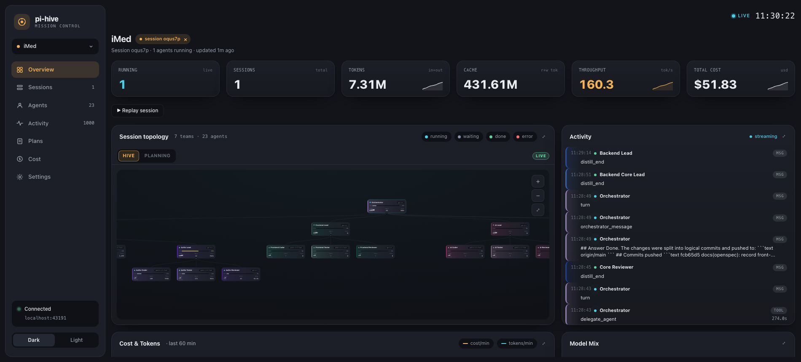

# pi-hive

A globally-installed extension for [Pi](https://github.com/earendil-works/pi-coding-agent), the coding agent by Earendil Works. `pi-hive` runs a **hierarchical team of agents** (a "hive") on a project: an Orchestrator delegates to team Leads, each Lead fans work out to its Members, each agent runs as its own `pi` subprocess with scoped tools and enforced filesystem domains, and a status view shows the live tree.

> **Note:** This is a Pi *host extension*, not a standalone Node library — it is loaded by Pi via `pi.extensions`, not `import`ed directly.



*The `/hive-observe` dashboard: live session topology (orchestrator → leads → members), per-session KPIs, streaming activity, cost, and model mix.*

## What this is

Most agent frameworks hand you a fixed swarm and a black box. `pi-hive` is the
opposite: **it's config-first, and you own the whole tree.** Nothing runs until
*you* describe the team.

- **Config-first — you own everything.** The extension does nothing until a
  project contains `.pi/hive/hive-config.yaml`. That one file is both the opt-in
  trigger *and* the team definition: you declare the agents, their models, their
  tools, their filesystem domains, and their nesting. Roles aren't magic — a node
  is a **lead** if it has members and a **member** if it doesn't, and an agent may
  delegate **only to its own direct reports**. You express permissions by nesting,
  not by writing policy. Every agent's prompt, knowledge, and skills live as plain
  files under `.pi/hive/` in your repo, versioned with your code. See
  **[SETUP.md](./SETUP.md)** for the full authoring guide.

- **A real hierarchy, not a flat swarm.** The visible session is an *orchestrator*
  that routes but never edits. It delegates to team **leads**, each lead fans work
  out to its **members**, and each agent runs as its own isolated `pi` subprocess
  with a scoped tool allow-list and **enforced write domains** — a worker
  physically cannot edit files outside the scope its lead granted it. Nesting goes
  arbitrarily deep.

- **Plan first, then execute — two separate teams.** The session runs in one of
  three modes (`normal → plan → hive`, cycled with `Ctrl+Alt+T`). **Plan mode**
  activates a `planning:` team that produces a full spec and writes *no code*.
  **Hive mode** activates a separate `hive:` team that executes an already-approved
  spec. They're distinct trees in your config so a project can never silently run
  planning against its coding tree.

- **Spec-driven, backed by OpenSpec.** Non-trivial work flows through fixed gates —
  `proposal → requirements → design → tasks` — stored under
  `.pi/hive/plans/<change-id>/`. [OpenSpec](https://github.com/Fission-AI/OpenSpec)
  (a CLI dependency) is the store and validator: it owns the artifact dependency
  graph and reports per-artifact readiness. Execution is hard-gated — `/hive-execute`
  refuses to run until `tasks.md` exists and its gate is approved.

- **Human-in-the-loop plan review, self-hosted.** `pi-hive` embeds a
  [Plannotator](https://github.com/backnotprop/plannotator) review surface **directly in its own
  dashboard** — no per-review server. You annotate, approve, or deny each plan
  artifact in the browser; approval unblocks the planner, a denial routes your
  feedback back and holds the gate. Verdicts persist to local SQLite.

- **Local, private telemetry.** Every session streams its own tailored event log to
  `.pi/hive/sessions/`, and `/hive-observe` opens a local Solid + Vite dashboard
  (`127.0.0.1:43191`) showing live topology, delegation lifecycle, tokens, and cost
  across every project and session. Nothing is sent to any third party.

## Install location & activation

Install from GitHub with `pi install` (recommended):

```sh
pi install git:github.com/demetere/pi-hive          # latest main
pi install git:github.com/demetere/pi-hive@v0.1.0   # pin a tag/commit
```

`pi install` also accepts the full HTTPS or SSH URL, e.g.
`pi install https://github.com/demetere/pi-hive` or
`pi install ssh://git@github.com/demetere/pi-hive`. Pi runs `npm install` for the
package, so the extension's runtime dependency
([OpenSpec](https://github.com/Fission-AI/OpenSpec)) is fetched automatically; the
Pi host packages are declared as peer dependencies and provided by Pi at load time.

You can also add it declaratively in Pi's `settings.json`:

```json
{
  "packages": ["git:github.com/demetere/pi-hive"]
}
```

For local development, load a checkout temporarily without installing:

```sh
pi -e .        # from the repository root
```

When installed, Pi auto-discovers the package for **every** project.

For repository-first development, use `just` as the command source of truth:

```sh
just pi-dev         # run this checkout temporarily with pi -e .
just pi-reload-dry-run # preview copying this checkout to ~/.pi/agent/extensions/pi-hive
just pi-reload         # update the user-level extension from this checkout
```

After `just pi-reload`, run `/reload` in Pi.

- **Activates only when a project contains `.pi/hive/hive-config.yaml`.** Without it, the extension registers nothing — no tools, no commands, no hooks — so non-hive projects are completely unaffected.

## Quickstart

1. Install the extension (see above), so Pi discovers it for every project.
2. In the project you want to run a hive on, create `.pi/hive/hive-config.yaml`. This file is the opt-in trigger and defines the team tree — the fastest way to author it is to point an agent at [SETUP.md](./SETUP.md) and let it interview you (see [Build a hive in a new project](#build-a-hive-in-a-new-project) below).
3. Start Pi in that project and press `Ctrl+Alt+T` (or run `/hive`) to enter hive mode; the visible session becomes a Lead that delegates to its team.
4. Run `/hive-observe` to open the live telemetry dashboard at `http://127.0.0.1:43191`.

`/hive-doctor` runs read-only diagnostics if anything looks off.

## Requirements

- **Bun ≥ 1.1** — the telemetry dashboard server (`src/observability/server/index.ts`) runs under Bun and uses `bun:sqlite`. The `/hive-observe` command notifies you if Bun is missing.
- The Pi host provides `@earendil-works/pi-coding-agent` and `@earendil-works/pi-tui` at load time (declared as peer deps).

## Packaging & distribution

This extension is self-contained and ships in two ways:

- **Git** — clone or submodule into `~/.pi/agent/extensions/`. The prebuilt dashboard (`ui/web/dist/`) is committed, so there is **no build step at install time**. Dependency folders are gitignored.
- **Tarball/package** — `just pack-dry-run` previews the published package contents. The root `package.json` `files` allowlist ships only runtime code + the prebuilt `dist/`; dependency folders never ship. The package prepack hook delegates to `just prepack`, so a published package can never contain stale UI.

After editing anything under `ui/web/src/`, rebuild the committed bundle:

```sh
just dashboard-build   # Vite build + stamp dist/.build-hash
```

Guard against shipping stale UI (wire into a pre-commit hook or CI):

```sh
just dashboard-verify  # fails if dist/ is out of date with src/
```

## Build a hive in a new project

Point an agent at the build guide and let it interview you:

> "Set up a hive for this project. Follow `~/.pi/agent/extensions/pi-hive/SETUP.md` — interview me for the teams, members, domains, and models, then scaffold `.pi/hive/`."

**[SETUP.md](./SETUP.md)** is the authoritative, self-contained playbook: the config + frontmatter schema, copy-paste templates for orchestrator/lead/member, the interview questions, conventions (tools, domains, distiller), and a validation checklist.

## Modes and commands (only registered when a hive is configured)

`pi-hive` has three hardcoded session modes: `normal` → `plan` → `hive` → `normal`. The cycle order is not configurable.

- `normal` — plain Pi chat. No hive tools or hive enforcement.
- `plan` — the `planning:` team is active. The visible main session should be `agent-type: planner`; plan gates run in order `proposal → requirements → design → tasks` under `.pi/hive/plans/<change-id>/`.
- `hive` — the `hive:` team is active. The visible main session should be `agent-type: lead`; execution agents build an approved `tasks.md`.

Commands:

- `/hive-normal`, `/hive-plan-mode`, `/hive` — switch to a specific mode.
- `/hive-toggle` or `Ctrl+Alt+T` — cycle `normal → plan → hive → normal`.
- `/hive-execute <change-id>` — validates that the change exists, has `tasks.md`, and the tasks gate is approved, then switches to hive mode and drives execution.
- `/hive-plan [change-id]` — list plan changes or select/show one.
- `/hive-status` — open the live hierarchy view (per-agent status, tokens, cost).
- `/hive-doctor` — run read-only diagnostics for opt-in config, loaded agents, dashboard assets, Bun availability, SDD state, and telemetry paths.
- `/hive-observe` — restart/open the local browser dashboard for global hive telemetry (`http://127.0.0.1:43191` by default).
- `/hive-observe-stop` — stop the telemetry dashboard on the configured port.

The hive tool set is mode/type scoped in code, not configurable by users: plan mode exposes planning/store/review tools to eligible planners/reviewers, hive mode exposes delegation/status/review tools to eligible execution agents, and normal mode exposes none. The dashboard host/port default to `127.0.0.1:43191` and can only be changed with `HIVE_TELEMETRY_HOST` / `HIVE_TELEMETRY_PORT`.

SDD/OpenSpec is the default operating mode for non-trivial hive work. Agent `skills:` paths are passed to worker Pi processes explicitly with `--no-skills` plus repeated `--skill <path>`, so Hive reuses Pi's native skill system without automatic discovery bleed-through.

## Layout of a configured project

```
.pi/hive/
  hive-config.yaml      # the team tree + global settings (also the activation trigger)
  agents/               # one folder per agent, mirroring the tree; each holds <name>.md + <name>-mental-model.yaml
  knowledge/            # always-inlined context/reference files
  skills/               # Pi Agent Skills explicitly granted to agents
  sessions/             # runtime transcripts + hive-events.jsonl telemetry (gitignore this)
```

See SETUP.md §4 for the full directory contract.

## Hive telemetry

`pi-hive` writes its own tailored telemetry stream to `.pi/hive/sessions/<session>/hive-events.jsonl` for each hive session and a live mutable state snapshot to `.pi/hive/sessions/<session>/hive-state.json`. Top-level sessions are also registered in a global index at `~/.pi/agent/hive/telemetry-sessions.jsonl`, so one `/hive-observe` dashboard can show hives from multiple projects and many simultaneously running sessions.

`/hive-observe` starts a local Bun/SSE dashboard with hive-specific views for project/session cards, topology, delegation lifecycle, worker state, tool activity, tokens, and cost. The dashboard also indexes events/state into local SQLite at `~/.pi/agent/hive/telemetry.db` for fast reloads and historical browsing. Telemetry persists even when the dashboard is not running; serve it only when you want to watch or inspect.

The dashboard UI is a prebuilt Solid + Vite single-page app under `ui/web/`. The
server (`src/observability/server/index.ts`) serves the built bundle from `ui/web/dist/`,
which is committed so end users need no build step. If you change anything under
`ui/web/src/`, rebuild it:

```sh
just dashboard-install # first time only
just dashboard-build   # rebuild dist/ — the server picks it up on next page load
```

Before publishing or opening a release PR, run the same gates as CI:

```sh
just ci
```

During UI development you can run `just dashboard-dev` (Vite HMR on port 43192) with a
telemetry server running on `HIVE_TELEMETRY_PORT`; the dev server proxies the
`/events`, `/states`, `/stream`, and `/health` endpoints to it.

This is not wired to a third-party observability server. Runtime knobs are hive-specific:

- `HIVE_TELEMETRY_PORT` — dashboard port, default `43191`
- `HIVE_TELEMETRY_HOST` — dashboard host, default `127.0.0.1`
- `HIVE_TELEMETRY_NO_OPEN=1` — start the server without opening a browser
- `HIVE_TELEMETRY_REGISTRY` — override the global session registry path
- `HIVE_TELEMETRY_DB` — override the local SQLite database path
